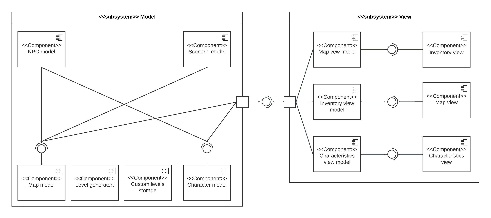

# Архитектура игры Hollow Rogue

## Список разработчиков

- Абрамов Никита
- Венедиктов Роман
- Филиппов Денис

## Общие сведения о системе
### Назначение

Hollow Rogue -- это игра в жанре roguelike с тайловой графикой.
Предназначена для развлечения.

### Границы системы
- Тайловая графика
- Управление производится с помощью клавиатуры
- Управление не настраиваемое
- Интерфейс отображается на экране целиком
- Карта представляет собой поле в декартовой системе координат
- Каждая локация (уровень) могут генерироваться независимо или задаваться через специальный файл

### Контекст системы

Игра используется в качестве развлекательного контента для большой группы лиц. Предполагается поддержка на платформах Linux и Mac OS

## Architecture drivers

### Технические ограничения
- Для выбранного языка программирования должна быть библиотека для работы с тайловой графикой

### Бизнес ограничения
- Команда разработчиков состоит из трех человек
- Необходимо показывать промежуточный функционал заказчику каждые 1-2 недели
- Приложение должно быть готовым в начале мая

### Качественные характеристики системы
- Важна расширяемость приложения
- Важна возможность произвольного расширения функционала по требованию заказчика
- Производительность не важна

### Основные функциональные требования
- Тайловая графика
- Персонаж игрока, способный перемещаться по карте, управляемый с клавиатуры
- Персонаж должен взаимодействовать с локацией, npc и предметами в инвентаре
- У персонажа должны быть характеристики
- Карта обычно генерируется, но для некоторых уровней грузится из файла

## Роли и случаи использования

### Основные роли
- Игрок
- Дизайнер уровней

### Случаи использования
- Игрок хочет разнообразия в игре, поэтому уровни должны генерироваться случайно и на них должно быть много предметов и npc
- Игрок хочет иметь возможность развиваться в игре по-разному, поэтому должно быть много комбинаций предметов
- Дизайнер уровней не умеет программировать, поэтому у него должна быть возможность без написания кода задать свой уровень

### Описание типичного пользователя

Жорик, 31 год. Работает сисадмином в крупной компании.
Увлекается компьютерными играми в жанре roguelike.
Часто сидит за компьютером, иногда хочет отдыхать от работы, при этом не устанавливая на него тяжелые игры.

# Композиция

Приложение спроектировано в клиент-серверной архитектуре с использованием паттерна MVVM.

## View

Подсистема, предназначенная для развёртывания на клиенте.
Отвечает за получение от пользователя команд и визуализацию состояния игры.

### Map view model

Следит за состоянием карты у модели, поддерживает данные в удобном для представления формате.

### Inventory view model

Следит за состоянием инвентаря у модели, поддерживает данные в удобном для представления формате.

### Characteristics view model

Следит за состоянием характеристик игрока у модели, поддерживает данные в удобном для представления формате.

### Inventory view

Отрисовывает окно инвентаря и обрабатывает соответствующие нажатия.

### Map view

Отрисовывает окно карты и обрабатывает соответствующие нажатия.

### Characteristics view

Отрисовывает окно характеристик игрока и обрабатывает соответствующие нажатия.

## Model

Подсистема, отвечающая за поддержку корректного состояния игры и её начало.
Может быть в будущем добавлена поддержка развёртывания на сервере, подключения нескольких пользователей и т.д.

### Map model

Контролирует положение объектов на карте, выставляет API для чтения и изменения положений.
Проверяет корректность перемещений.

### Level generator

Генерирует рандомные карты.

### Custom levels storage

Отвечает за хранение и загрузку пользовательских уровней.

### Character model

Компонента поддерживает состояние всех персонажей в игре, их здоровье, инвентарь и т.п.

### Scenario model

Компонента контролирует исполнение триггерных событий в игре.
(Пришёл в нужное место, появился босс или переместился на другую карту)

### NPC model

Компонента, содержащая алгоритмы, управляющие NPC.

# Логическая структура

## Диаграмма классов для подсистемы View

### LayoutController

Контролирует то, какой Layout сейчас отображается в окне.

### Layout

Контролирует отображение элементов в окне, их перерисовку и обрабатывает нажатие hotkey.

### MainLayout

Основной `Layout`, содержащий карту, инвентарь и характеристики игрока

### LayoutFactory

Фабрика порождающая `Layout`.
Нужна для того, чтобы `LayoutController` мог удалять те, которые редко используются.

### MainLayoutFactory

Фабрика порождающая `MainLayout`.

### Graphics

Библиотечный класс для отрисовки графики.

### GraphicsWindow

Класс, инкапсулирующий подокно во всём окне для отрисовки графики.

### View

Элемент `Layout`, отвечающий за отрисовку какой-то определённой части сцены.

### MapView

Отрисовывает карту.

### CharacteristicsView

Отрисовывает характеристики игрока.

### InventoryView

Отрисовывает инвентарь игрока.

### AggregateView

Разделяет окно на меньшие и передаёт отрисовку другим `View`.

### MapElementPresentationStorage

Хранилище картинок для элементов карты.

### MapViewModel

Отображает состояние карты для `MapView`.

### CharacteristicsViewModel

Отображает состояние характеристик для `CharacteristicsView`.

### InventoryViewModel

Отображает состояние инвентаря для `InventoryView`.

### ModelConnection

Выставляет API модели

## Диаграмма классов для подсистемы Model

### Game
Содержит текущее уровень, а также `ModelCharacterConnection`, позволяющий менять управлять
игрой от имени персонажа, которым управляет игрок.

### ModelViewConnection
Позволяет получать информацию о текущем состоянии карты.

### ModelCharacterConnection
Позволяет менять состояние игры персонажем (двигаться, атаковать), а также получать
информацию о текущем состоянии карты, дающую возможность выбирать, как действовать.

### ModelSceneControllerConnection
Позволяет менять элементы на карте, а также получать информацию о текущем состоянии карты.

### SceneController
Контролирует исполнение триггерных событий в игре. Например, персонаж пришёл
в определенное место -- появляется босс. Использует `ModelSceneControllerConnection` для
обновления состояния игры.

### NPCController
Управляет персонажем, неподконтрольным игроку (non-player character),
в соответствии с `Behaviour`.

### State
Интерфейс, который задает состояние моба и определяет его поведение

### Behaviour
Задает поведение, в соответствии с которым `NPCController` управление
персонажем.

### GameMap
Игровая карта, состоящая `width` на `height` клеток. В каждой клетке
хранится `MapElement` -- стек `GameObject`. Есть возможность получать
и задавать объекты в клетках, передвигать персонажей, а также осуществлять атаки
персонажами.

### GameObject
Объект, который может находиться в клетке карты. Хранит в себе идентификатор, используемый
для 

### Searchable
Объект, который обладает идентификатором, позволяющим отличать этот
объект от других объектов на карте.

### Inventory
Объект, который персонаж может подобрать и использовать. Каждый инвентарь обладает набором
характеристик, которые могут влиять на персонажа (увеличивать его здоровье, урон при атаке и т.п.).

### ImmutableCharacter
Персонаж "овощь", который ничего не может делать, только хранит параметры,
присущие всем персонажам (здоровье, инвентарь и т.п.).

### Character
Персонаж, который может перемещаться по карте, атаковать других персонажей,
подбирать и использовать инвентарь.

### CloneableCharacter
Персонаж, который может быть клонирован.

### Level
Содержит текущее состояние игры: карта с объектами, персонажи для управления
игроком и NPCController.

### Mob
Содержит персонажа и поведение, в соответствии с которым этот персонаж
должен управляться NPCController-ом.

### AbstractMobFactory
Абстрактная фабрика мобов с различным поведением.

### AbstractInventoryFactory
Абстрактная фабрика различного инвентаря (одежды, оружия и т.п.)

### LevelBuilder
Строитель уровня.

### RandomLevelBuilder
Строитель уровня, который строит случайный уровень.

### FileLevelBuilder
Строитель уровня, который строит уровень, заданный в файле.

# Взаимодействия и состояния
### Диаграмма конечных автоматов

### Диаграмма последовательностей

Как видно из диаграммы конечных автоматов процесс цикличен, поэтому разберем один шаг

# Обоснование выбора
В качестве языка программирования был выбран Kotlin в связи с тем, что он удобен для всей команды.
На языках вроде C++ писать сложнее из-за ручной работы с памятью, а на C# у команды нет опыта разработки.

Так же он совместим с библиотеками Java, что дает доступ к встроенному модулю java.awt.Graphics, который дает удобную
разработку тайловой графики.

