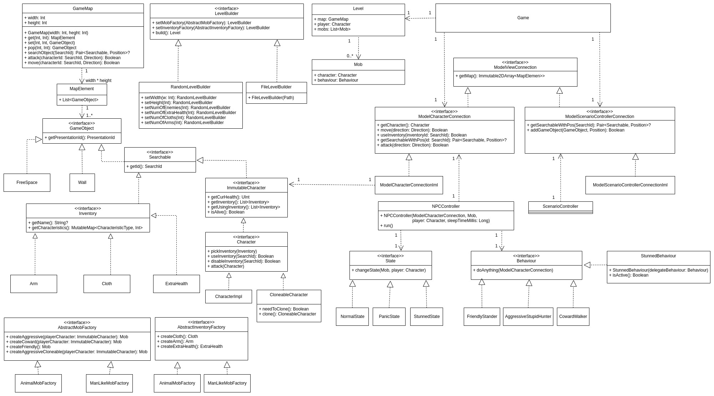

# Диаграмма классов для подсистемы Model

## Game
Содержит текущее состояние игры: карта с объектами, действующие
персонажи, а также позволяющий менять состояние через `ModelConnection`.

## ModelConnection
Позволяет менять состояние игры, добавлять новые объекты, осуществлять
действия персонажей и др.

## SceneController
Контролирует исполнение триггерных событий в игре. Например, персонаж пришёл
в определенное место -- появляется босс. Использует `ModelConnection` для
обновления состояния игры.

## NPC
Non-player character, управляет персонажами, неподконтрольными игроку в
соответствии с `Behaviour`.

## Behaviour
Задает поведение NPC, как персонаж двигается, атакует.

## GameMap
Игровая карта, состоящая `width` на `height` клеток. В каждой клетке
хранится `MapElement` -- стек `GameObject`. Есть возможность получать
и задавать объекты в клетках.

## GameObject
Объект, который может находиться в клетке карты.

## Searchable
Объект, который обладает идентификатором, позволяющим отличать этот
объект от других объектов на карте.

## Pickable
Объект, который персонаж может подобрать, и, возможно, использовать.

## Character
Персонаж, который может перемещаться по карте, атаковать других персонажей,
использовать разное оружие, одежду и др.

## LevelGenerator
Позволяет генерировать различные карты

## CustomLevelStorage
Позволяет загружать и сохранять карты

