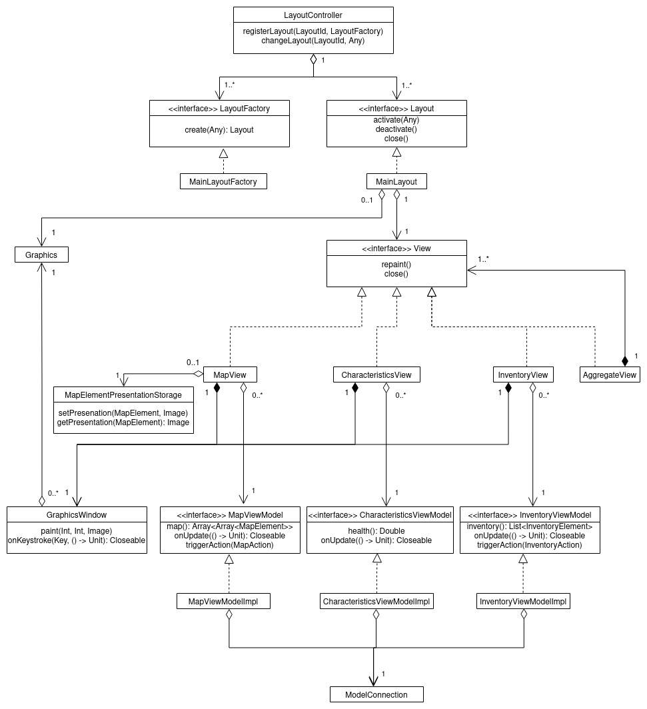

# Диаграмма классов для подсистемы View

## LayoutController

Контролирует то, какой Layout сейчас отображается в окне.

## Layout

Контролирует отображение элементов в окне, их перерисовку и обрабатывает нажатие hotkey.

## MainLayout

Основной `Layout`, содержащий карту, инвентарь и характеристики игрока 

## LayoutFactory

Фабрика порождающая `Layout`. 
Нужна для того, чтобы `LayoutController` мог удалять те, которые редко используются.

## MainLayoutFactory

Фабрика порождающая `MainLayout`.

## Graphics

Библиотечный класс для отрисовки графики.

## GraphicsWindow

Класс, инкапсулирующий подокно во всём окне для отрисовки графики.

## View

Элемент `Layout`, отвечающий за отрисовку какой-то определённой части сцены.  

## MapView

Отрисовывает карту.

## CharacteristicsView

Отрисовывает характеристики игрока.

## InventoryView

Отрисовывает инвентарь игрока.

## AggregateView

Разделяет окно на меньшие и передаёт отрисовку другим `View`.

## MapElementPresentationStorage

Хранилище картинок для элементов карты.

## MapViewModel

Отображает состояние карты для `MapView`.

## CharacteristicsViewModel

Отображает состояние характеристик для `CharacteristicsView`.

## InventoryViewModel

Отображает состояние инвентаря для `InventoryView`.

## ModelConnection

Выставляет API модели 
